# XoQ — Anything over QUIC

Remote hardware access for robotics over the internet.

- **100% AI-native** — entire codebase generated with AI for low level optimization
- **100% Rust** — single binary, no runtime deps, no GC
- **100% hardware-optimized** — zero-copy paths, no intermediary abstractions, direct V4L2/AVFoundation/SocketCAN access
- **100% cross-compatible** — virtualize your robot and connect from anywhere, any OS (Linux, macOS, Windows), any language (Python, Rust, JavaScript)

```
Robot Hardware          Network              Clients
┌──────────┐     ┌──────────────────┐     ┌──────────────┐
│ Camera   │     │  Iroh (P2P)      │     │ Python       │
│ Serial   │────▶│  MoQ  (Relay)    │────▶│ JavaScript   │
│ CAN Bus  │     │  QUIC / TLS 1.3  │     │ Rust         │
│ Audio    │     │                  │     │              │
└──────────┘     └──────────────────┘     └──────────────┘
  XoQ Server                                XoQ Client
```

### OpenArm Example

```mermaid
flowchart TD
    subgraph leader["OpenArm Linux (leader)"]
        cam1[RealSense Camera]
        can1[CAN Bus / Motors]
    end

    subgraph follower["OpenArm Linux (follower)"]
        cam2[RealSense Camera]
        can2[CAN Bus / Motors]
    end

    relay((MoQ Relay<br/>cdn.1ms.ai))

    cam1 -- "AV1 video + depth (MoQ)" --> relay
    can1 -- "CAN state (MoQ)" --> relay
    relay -- "motor commands (MoQ)" --> can1

    cam2 -- "AV1 video + depth (MoQ)" --> relay
    can2 -- "CAN state (MoQ)" --> relay
    relay -- "motor commands (MoQ)" --> can2

    relay <-- "WebTransport (MoQ)" --> hf["🤗 HuggingFace Space<br/>openarm.html"]
    relay <-- "WebTransport (MoQ)" --> browser["Browser Viewer"]
    relay <-- "QUIC (MoQ)" --> mac["macOS Client"]

    leader <-- "P2P serial (iroh)" --> follower
    leader <-- "P2P serial (iroh)" --> mac
```



## Comparison Table

|                         | XoQ                                 | WebRTC                                      | rosbridge       | gRPC               | ROS 2 (DDS)         |
| ----------------------- | ----------------------------------- | ------------------------------------------- | --------------- | ------------------ | ------------------- |
| **Setup**               | Single binary, Public Key + Relay   | Complex (Signaling + STUN/TURN + SDP + ICE) | ROS + rosbridge | Protobuf toolchain | ROS + DDS vendor    |
| **Encryption**          | Always on (TLS 1.3)                 | Always on (DTLS)                            | None by default | Optional TLS       | Optional SROS2      |
| **P2P / NAT traversal** | Built-in (Iroh)                     | ICE/STUN/TURN                               | No              | No                 | No                  |
| **Zero-copy HW**        | Yes (V4L2, AVFoundation, SocketCAN) | No                                          | No              | No                 | No                  |
| **Browser**             | WebTransport (MoQ)                  | Yes                                         | Yes             | grpc-web (limited) | No                  |
| **Transport**           | QUIC / TLS 1.3                      | DTLS / SRTP                                 | TCP / WebSocket | HTTP/2             | DDS (UDP multicast) |
| **Languages**           | Python, JS, Rust                    | JS, native SDKs                             | Any (JSON)      | Any (codegen)      | Python, C++         |
| **Cross-platform**      | Linux, macOS, Windows               | All (browser)                               | Linux (primary) | All                | Linux (primary)     |

## Use Cases

| Use Case                              | How XoQ Helps                                                                                                                                              |
| ------------------------------------- | ---------------------------------------------------------------------------------------------------------------------------------------------------------- |
| **Remote teleoperation**              | Full-duplex serial/CAN bridging with sub-ms overhead — operate arms, grippers, and mobile bases over the internet as if wired locally                      |
| **RL / VLM online training at scale** | Stream camera + proprioception from a fleet of robots to GPU clusters; drop-in Python clients mean training scripts don't change                           |
| **Inference at scale**                | Send model outputs back to robots over the same QUIC connection; encrypted P2P means no VPN or port forwarding per robot                                   |
| **CI/CD of robots**                   | Run hardware-in-the-loop tests from anywhere — flash firmware over remote serial, validate CAN protocols, and capture camera feeds without physical access |

---

## Roadmap

| Feature                          | Description                                                                                                                               |
| -------------------------------- | ----------------------------------------------------------------------------------------------------------------------------------------- |
| CMAF Format                      | Fragmented MP4 for dataset recording with robotic data track for Training dataset streaming (online + offline, compatible with inference) |
| Framework compat                 | dora-rs, ROS, ROS2, and LeRobot                                                                                                           |
| Embedded targets                 | ESP32 / STM32 (server and client)                                                                                                         |
| Intel RealSense / lidar / Orbbec | Color + depth streaming done; `pyrealsense2` drop-in replacement TBD                                                                                                        |
| C/C++ bindings                   | Via Rust ABI                                                                                                                              |

---

## Reference

### Hardware Support

| Device  | Server Platform       | HW Encoding / Processing        | Feature Flags           |
| ------- | --------------------- | ------------------------------- | ----------------------- |
| Camera  | Linux (V4L2)          | NVIDIA NVENC (H.264/HEVC)       | `camera`, `nvenc`       |
| Camera  | macOS (AVFoundation)  | Apple VideoToolbox (H.264)      | `camera-macos`, `vtenc` |
| Serial  | Linux, macOS, Windows | —                               | `serial`                |
| CAN Bus | Linux (SocketCAN)     | —                               | `can`                   |
| Audio   | Linux, macOS, Windows | cpal (ALSA/CoreAudio/WASAPI)    | `audio`                 |
| Audio   | macOS (VPIO)          | AEC + Noise Suppression + AGC   | `audio-macos`           |
| Depth   | Linux (RealSense)     | NVIDIA NVENC (H.264)            | `realsense`             |

## Getting Started

### Bridge a camera

Server (on the machine with the camera):

```bash
cargo run --bin camera-server --features "iroh,camera-macos,vtenc" -- 0 --h264
# Linux Nvidia: --features "iroh,camera,nvenc"
```

Python client:

```python
import xoq_cv2

cap = xoq_cv2.VideoCapture("<server-endpoint-id>")
while cap.isOpened():
    ret, frame = cap.read()  # numpy array (H, W, 3)
    if not ret:
        break
    print(f"Frame: {frame.shape}")
cap.release()
```

### Bridge a serial port

Server:

```bash
cargo run --bin serial-server --features "iroh,serial" -- /dev/ttyUSB0 1000000
```

Python client:

```python
import serial

port = serial.Serial("<server-endpoint-id>", baudrate=1000000)
port.write(b"\xff\xff\x01\x04\x02\x00\x00\xf8")
response = port.read(64)
print(response)
port.close()
```

### Bridge a RealSense depth camera

Server (Linux with NVIDIA GPU + RealSense camera):

```bash
cargo run --bin realsense-server --features realsense -- \
  --relay https://your-relay:4443 --path anon/realsense
```

Publishes two H.264/CMAF tracks over MoQ: `video` (color) and `depth` (grayscale, auto-calibrated depth range).
Auto-detects depth scale, camera intrinsics, and optimal depth mapping on startup.

Open `examples/realsense_viewer.html` for 2D playback or `examples/realsense_pointcloud.html` for a real-time colored 3D point cloud (Three.js + WebTransport).

```
--serial <serial>    Select a specific camera (listed at startup)
--min-depth <mm>     Override min depth (default: auto)
--max-depth <mm>     Override max depth (default: auto)
```

### Bridge audio

Server (macOS with Voice Processing IO — AEC/noise suppression/AGC):

```bash
cargo run --bin audio-server --features "iroh,audio-macos"
# Linux/Windows (cpal backend): --features "iroh,audio"
# Disable VPIO on macOS: --no-vpio
```

Python client:

```python
import sounddevice

stream = sounddevice.new("<server-endpoint-id>").sample_rate(48000).channels(1).open()
chunk = stream.read_chunk()  # numpy array
stream.write_chunk(chunk)    # bidirectional
stream.close()
```

### Bridge a CAN bus

Server:

```bash
cargo run --bin can-server --features "iroh,can" -- can0:fd
```

Python client:

```python
import can

bus = can.Bus("<server-endpoint-id>")
bus.send(can.Message(arbitration_id=0x123, data=[0x01, 0x02, 0x03]))
for msg in bus:
    print(f"ID={msg.arbitration_id:#x} data={msg.data.hex()}")
```

---

### MoQ (Relay) Mode

The examples above use **Iroh (P2P)** — direct connections between server and client. XoQ also supports **MoQ (Relay)** mode for browser-based access and 1-to-many broadcasting via a relay server.

#### 1. Run the MoQ Relay

You need a self-hosted [moq-relay](https://github.com/kixelated/moq-rs):

```bash
# Build
git clone https://github.com/kixelated/moq-rs && cd moq-rs
cargo build --release -p moq-relay

# Run with self-signed TLS (dev)
moq-relay --server-bind 0.0.0.0:4443 --tls-generate localhost --auth-public anon

# Run with real TLS certs (prod)
moq-relay --server-bind 0.0.0.0:4443 \
  --tls-cert /path/to/cert.pem --tls-key /path/to/key.pem \
  --web-http-listen 0.0.0.0:4443 --auth-public anon
```

> **Note:** `cdn.moq.dev` does NOT forward announcements between sessions — cross-session pub/sub requires a self-hosted relay.

#### 2a. Bridge a CAN Bus over MoQ

The CAN MoQ server broadcasts CAN state to all subscribers (1-to-many) and accepts commands from any publisher (many-to-1).

Server (Linux with SocketCAN):

```bash
# Unified can-server with MoQ relay (recommended — supports multiple interfaces + iroh P2P)
cargo run --release --bin can-server --features "iroh,can" -- \
  can0:fd can1:fd can2:fd can3:fd --moq-relay https://cdn.1ms.ai

# Or dedicated MoQ-only server (single interface)
cargo run --release --bin moq-can-server --features can -- \
  can0 --relay https://cdn.1ms.ai
```

The default broadcast path is `anon/xoq-can-<interface>/state` (e.g., `anon/xoq-can-can0/state`), and the command path is `anon/xoq-can-<interface>/cmd`.

Browser client — open the web examples:

```bash
cd js && npm install && npm run examples
# Open http://localhost:5173/openarm.html    — 3D robot arm visualizer (Damiao motors)
# Open http://localhost:5173/can_cmd_test.html — CAN command publisher
```

`openarm.html` subscribes to the CAN state broadcast, parses Damiao motor frames, and renders a 3D robot arm in real-time. It also publishes motor query commands back through the relay.

#### 2b. Bridge a Serial Port over MoQ

The serial MoQ server provides bidirectional pass-through — raw bytes flow between the browser and the serial device via the relay.

Server (Linux/macOS/Windows):

```bash
cargo run --release --bin moq-serial-server --features serial -- \
  /dev/ttyACM0 1000000 https://172.18.133.111:4443 anon/xoq-serial
#  ^port        ^baud   ^relay URL                   ^MoQ path
```

Browser client:

```bash
cd js && npm install && npm run examples
# Open http://localhost:5173/urdf_viewer.html — URDF robot viewer (FeeTech STS3215 servos)
```

`urdf_viewer.html` loads a URDF robot model (SO101 by default), connects to the serial server via MoQ, sends FeeTech read commands, and updates the 3D joint angles in real-time.

#### MoQ Architecture

```
Browser (WebTransport)          MoQ Relay              Server (QUIC)
┌────────────────────┐     ┌──────────────┐     ┌──────────────────┐
│ Publish  {path}/c2s│────▶│              │────▶│ Subscribe {path}/c2s │
│                    │     │  moq-relay   │     │                      │
│ Subscribe{path}/s2c│◀────│              │◀────│ Publish   {path}/s2c │
└────────────────────┘     └──────────────┘     └──────────────────────┘
      @moq/lite                                    moq-native (Rust)
```

- **CAN server** uses a broadcast pattern: publishes state on a `state` track (1-to-many), subscribes to commands on a `cmd` track (many-to-1)
- **Serial server** uses a bidirectional stream pattern (`MoqStream`): each side publishes on one sub-path and subscribes to the other (`c2s` / `s2c`)
- Browsers connect via **WebTransport** (with WebSocket fallback for self-signed certs)
- Native clients connect via **QUIC**

---

### Client Libraries

#### Python

Drop-in replacements for popular hardware libraries — same API, remote hardware:

| Package            | Import              | Replaces      | API Surface                                                    |
| ------------------ | ------------------- | ------------- | -------------------------------------------------------------- |
| `xoq-serial`       | `import serial`     | pyserial      | `Serial`: read, write, readline, context manager               |
| `xoq-can`          | `import can`        | python-can    | `Bus`, `Message` with full CAN FD fields, send/recv/iterator   |
| `xoq-opencv`       | `import xoq_cv2`    | opencv-python | `VideoCapture`: read, isOpened, release — returns numpy arrays |
| `xoq-sounddevice`  | `import sounddevice` | sounddevice   | `Stream`: read_chunk, write_chunk, bidirectional audio         |

Install individually or all at once:

```bash
pip install xoq-serial xoq-can xoq-opencv xoq-sounddevice
# or
pip install xoq[all]
```

Build from source with maturin:

```bash
cd packages/serial && maturin develop --release
cd packages/can && maturin develop --release
cd packages/cv2 && maturin develop --features videotoolbox --release
cd packages/sounddevice && maturin develop --release
```

#### JavaScript / TypeScript

```bash
npm install xoq
```

MoQ pub/sub for web — serial streaming and camera frames over WebTransport.

#### Rust

```toml
[dependencies]
xoq = { version = "0.3", features = ["serial-remote", "camera-remote", "can-remote", "audio-remote"] }
```

Feature flags for remote access: `serial-remote`, `camera-remote`, `can-remote`, `audio-remote`.

Clients target macOS, Linux, and Windows. Future: C/C++ bindings via Rust ABI.

### Server Binaries

| Binary              | Description                                                 | Required Features                |
| ------------------- | ----------------------------------------------------------- | -------------------------------- |
| `camera-server`     | Streams local cameras to remote clients (JPEG or H.264)     | `iroh` + `camera`/`camera-macos` |
| `serial-server`     | Bridges a local serial port for remote access               | `iroh`, `serial`                 |
| `can-server`        | Bridges local CAN interfaces for remote access              | `iroh`, `can`                    |
| `audio-server`      | Bridges local mic/speaker for remote access (VPIO on macOS) | `iroh`, `audio` / `audio-macos`  |
| `realsense-server`  | Streams color + depth from RealSense over MoQ               | `realsense`                      |
| `moq-can-server`    | CAN bridge over MoQ relay                                   | `can`                            |
| `moq-serial-server` | Serial bridge over MoQ relay                                | `serial`                         |

### Examples

| Example            | Description                                                | Required Features  |
| ------------------ | ---------------------------------------------------------- | ------------------ |
| `camera_client`    | Receives and displays frames from remote camera            | `camera-remote`    |
| `camera_viewer.py` | Python OpenCV viewer for camera streams                    | (Python)           |
| `serial_client`    | Connects to a remote serial port                           | `iroh`, `serial`   |
| `can_client`       | Connects to a remote CAN interface                         | `iroh`, `can`      |
| `audio_client`     | Connects to a remote audio server (bidirectional)          | `audio-remote`     |
| `rustypot_remote`  | Drives STS3215 servos over a remote serial port (rustypot) | `iroh`, `serial`   |
| `so100_teleop`     | Teleoperate a remote SO-100 arm from a local leader arm    | `iroh`, `serial`   |
| `reachy_mini`      | Reachy Mini robot control over remote serial               | `iroh`, `serial`   |
| `moq_test`         | MoQ relay publish/subscribe diagnostic test                | —                  |

#### Web Examples (`js/examples/`, run with `cd js && npm run examples`)

| Example              | Description                                                     |
| -------------------- | --------------------------------------------------------------- |
| `openarm.html`       | 3D OpenArm visualizer — CAN motor state via MoQ (Damiao motors) |
| `urdf_viewer.html`   | URDF robot viewer — serial servo state via MoQ (FeeTech STS3215)|
| `can_cmd_test.html`  | CAN command publisher — send raw CAN frames via MoQ             |
| `publish.html`       | Serial → MoQ publisher (WebSerial)                              |
| `subscribe.html`     | MoQ → Console subscriber                                       |

### ALPN Protocols

| Protocol            | Purpose                                   |
| ------------------- | ----------------------------------------- |
| `xoq/p2p/0`         | Generic P2P communication (serial, CAN)   |
| `xoq/camera/0`      | Camera streaming (legacy, JPEG)           |
| `xoq/camera-jpeg/0` | Camera streaming with JPEG frames         |
| `xoq/camera-h264/0` | Camera streaming with H.264 encoding      |
| `xoq/camera-hevc/0` | Camera streaming with HEVC/H.265 encoding |
| `xoq/camera-av1/0`  | Camera streaming with AV1 encoding        |
| `xoq/audio-pcm/0`   | Bidirectional PCM audio streaming          |

### Cargo Feature Flags

| Flag            | Purpose                                          |
| --------------- | ------------------------------------------------ |
| `iroh`          | Iroh P2P transport                               |
| `serial`        | Local serial port access (server)                |
| `camera`        | V4L2 camera capture (Linux server)               |
| `camera-macos`  | AVFoundation camera capture (macOS server)       |
| `nvenc`         | NVIDIA NVENC H.264/HEVC encoding (Linux server)  |
| `vtenc`         | Apple VideoToolbox H.264 encoding (macOS server) |
| `can`           | SocketCAN access (Linux server)                  |
| `audio`         | Audio I/O via cpal (cross-platform server)       |
| `audio-macos`   | macOS Voice Processing IO (AEC/NS/AGC)           |
| `serial-remote` | Remote serial client (cross-platform)            |
| `camera-remote` | Remote camera client (cross-platform)            |
| `can-remote`    | Remote CAN client (cross-platform)               |
| `audio-remote`  | Remote audio client (cross-platform)             |
| `realsense`     | Intel RealSense depth camera (Linux server)      |
| `image`         | Image processing support                         |

### Prerequisites

#### Intel RealSense SDK (for depth cameras)

```bash
# Add Intel RealSense repo
sudo mkdir -p /etc/apt/keyrings
curl -sSf https://librealsense.intel.com/Debian/librealsense.pgp | sudo tee /etc/apt/keyrings/librealsense.pgp > /dev/null
echo "deb [signed-by=/etc/apt/keyrings/librealsense.pgp] https://librealsense.intel.com/Debian/apt-repo `lsb_release -cs` main" | \
  sudo tee /etc/apt/sources.list.d/librealsense.list
sudo apt update

# Install
sudo apt install librealsense2-dev librealsense2-utils
```

#### NVIDIA Video Codec SDK (for NVENC AV1/H.264 encoding)

```bash
sudo apt install nvidia-cuda-toolkit
```

The NVENC headers are bundled in `packages/nvidia-video-codec-sdk/`. Requires an NVIDIA GPU with NVENC support (GTX 1650+, RTX 20+ for H.264; RTX 30+ for AV1).

#### CAN Bus Setup (Linux, PCAN USB Pro FD)

```bash
# 1. Stop the can-server first (it holds stale socket handles)
systemctl --user stop can-server

# 2. Bring all interfaces down
sudo ip link set can0 down
sudo ip link set can1 down
sudo ip link set can2 down
sudo ip link set can3 down

# 3. Bring them up: CAN FD (1 Mbps nominal, 5 Mbps data) + auto-restart from BUS-OFF
sudo ip link set can0 up type can bitrate 1000000 dbitrate 5000000 fd on restart-ms 100
sudo ip link set can1 up type can bitrate 1000000 dbitrate 5000000 fd on restart-ms 100
sudo ip link set can2 up type can bitrate 1000000 dbitrate 5000000 fd on restart-ms 100
sudo ip link set can3 up type can bitrate 1000000 dbitrate 5000000 fd on restart-ms 100

# 4. Start the CAN server
can-server can0:fd can1:fd --moq-relay https://cdn.1ms.ai
```

> **Important:** Always stop the can-server before reconfiguring interfaces — otherwise it holds stale sockets and writes fail with "No such device or address". The `restart-ms 100` flag is critical for auto-recovery from BUS-OFF state.

### License

Apache-2.0

---

## Explanation

> How and why XOQ works the way it does

### Architecture

#### Transport Layer

```
                 ┌─────────┐     ┌─────────┐
                 │  Iroh   │     │   MoQ   │
                 │  (P2P)  │     │ (Relay) │
                 └────┬────┘     └────┬────┘
                      └───────┬───────┘
                           QUIC / TLS 1.3
                              │
                    ┌─────────┴─────────┐
                    │  Application      │
                    │  Protocol (ALPN)  │
                    └───────────────────┘
```

Both transports converge on the same QUIC layer. The ALPN protocol determines what flows over the connection.

#### Zero-Copy Data Path (macOS Camera)

```
AVFoundation callback
       │
       ▼  (0 copies — CFRetain on CVPixelBuffer)
RetainedPixelBuffer
       │
       ▼  (0 copies — pointer pass to VideoToolbox)
VtEncoder.encode_pixel_buffer()
       │
       ▼  H.264 NAL units
CMAF muxer  (pre-allocated Vec)
       │
       ▼  fragmented MP4 segments
QUIC send
```

From camera capture to network send: **zero memcpy of pixel data**. The CVPixelBuffer pointer is retained (CFRetain) and passed directly to VideoToolbox for hardware encoding. The encoder outputs compressed NAL units which are muxed into CMAF fragments and sent over QUIC.

#### Thread Model

```
Camera Server:
├─ Capture thread       (AVFoundation/V4L2, blocking I/O)
├─ Encoder task         (async, hardware-accelerated — NVENC or VideoToolbox)
├─ Muxer task           (async, CMAF fragmentation)
└─ Transport task       (async, QUIC streams)

CAN / Serial Server:
├─ Reader thread        (blocking I/O) → channel(16)
├─ Writer thread        (blocking I/O) ← channel(1)
└─ Connection handler   (async, batching)
```

Camera uses dedicated threads for capture (hardware I/O is blocking) with async tasks for encoding, muxing, and transport. CAN and serial servers use a reader/writer thread pair with bounded channels bridging to the async connection handler.

#### ALPN Negotiation

Clients negotiate the best encoding by trying ALPNs in preference order (H.264 > JPEG > legacy).
